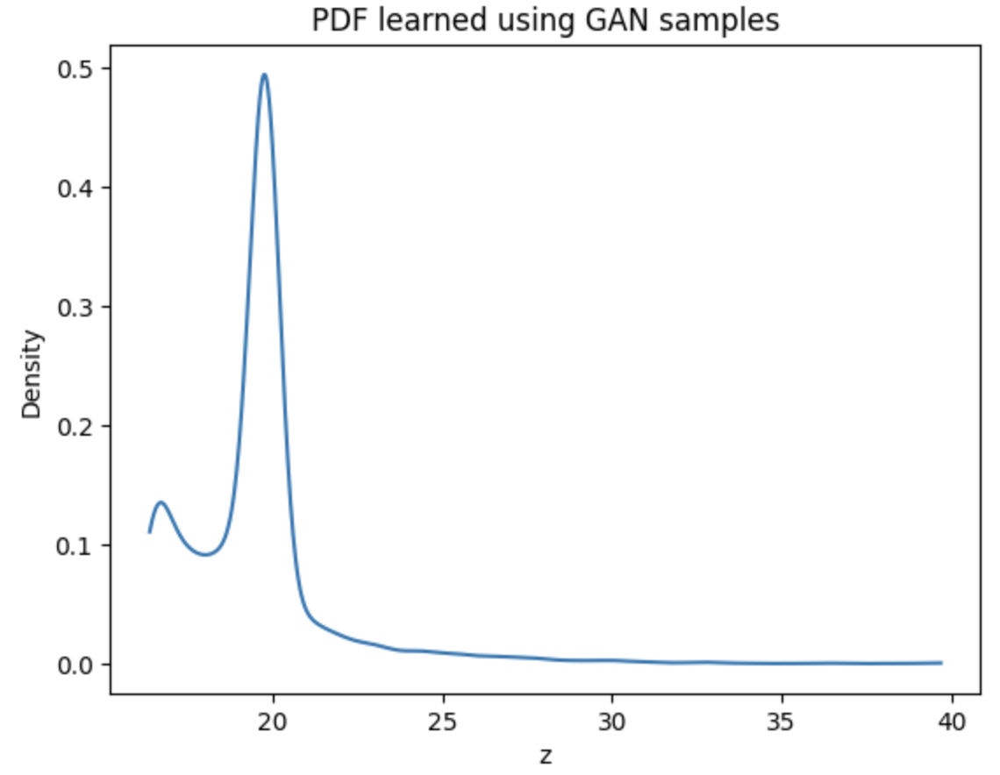

# Assignment 2 – GAN-based PDF Learning

This assignment focuses on learning the probability density function (PDF) of a transformed NO₂ feature using a Generative Adversarial Network (GAN), without assuming any parametric distribution.

---

## 1. Data and Transformation

The NO₂ column from the provided air quality dataset is used as the base feature x.
Each value is transformed using a roll-number-dependent function:

z = x + a_r sin(b_r x)

where:

a_r = 0.5 * (r mod 7)
b_r = 0.3 * ((r mod 5) + 1)

The roll number r ensures that each student obtains a unique transformed distribution.

---

## 2. GAN Architecture

A simple one-dimensional GAN is used to learn the distribution of the transformed variable z.

Generator:
- Input: 1D random noise
- Two fully connected hidden layers with non-linear activation
- Output: 1D generated sample

Discriminator:
- Input: 1D sample
- One hidden layer with non-linear activation
- Output: Sigmoid probability indicating real or fake

The GAN is trained using binary cross-entropy loss and the Adam optimizer.

---

## 3. PDF Estimation

After training, the generator is used to produce a large number of samples.
The PDF is estimated from these samples using a data-driven method such as a histogram or KDE.
No parametric distribution is assumed.

---

## 4. Observations

Mode Coverage:
- The generator captures a limited region of the data space.
- Some modes of the empirical distribution may not be fully represented.

Training Stability:
- Generator and discriminator losses show fluctuations during training.
- This behavior is typical for GANs trained on low-dimensional data.

Quality of Generated Distribution:
- The generated samples form a valid probability distribution.
- The learned PDF is approximate and reflects GAN limitations.

---

## 5. Repository Contents

- assignment2.ipynb : Jupyter notebook containing implementation and outputs
- README.md : Description of methodology, results, and observations
