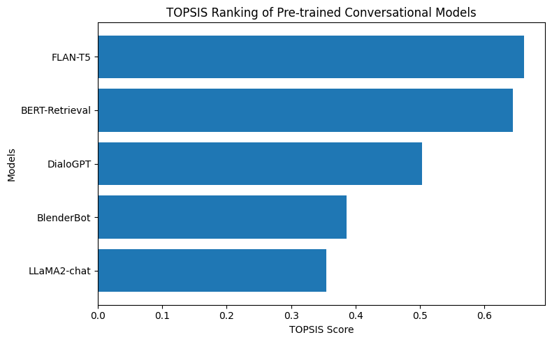

# Pretrained Conversational Model Comparison Using TOPSIS

## Overview

Conversational AI models are a core component of modern Natural Language
Processing (NLP) systems and are widely used in applications such as
chatbots, virtual assistants, customer support automation, and
interactive recommendation systems. These models are designed to
generate context-aware, fluent, and relevant responses during
human--machine interactions.

This project presents a comparative evaluation of multiple pre-trained
conversational models using the TOPSIS (Technique for Order Preference
by Similarity to Ideal Solution) method. Instead of relying on a single
evaluation metric, TOPSIS enables a balanced comparison by considering
both dialogue quality and computational efficiency.

## Objective

The primary objectives of this project are:

-   To evaluate multiple pre-trained conversational models on dialogue
    generation tasks\
-   To compare models using multiple quantitative and qualitative
    metrics\
-   To apply TOPSIS for multi-criteria decision-making\
-   To identify the most suitable conversational model based on overall
    performance

## Models Evaluated

The following pre-trained conversational models were evaluated:

-   DialoGPT\
-   BlenderBot\
-   FLAN-T5\
-   BERT-based Retrieval Conversational Model\
-   LLaMA-2 Chat

These models vary in architecture, response generation capability,
inference speed, and resource requirements.

## Dataset

The evaluation was conducted using conversational prompts derived from
the DailyDialog dataset, which contains human-like everyday
conversations across multiple scenarios.

A fixed subset of prompts and reference responses was used to ensure
consistent and comparable evaluation across all conversational models.

## Evaluation Metrics

### Benefit Criteria (Higher is Better)

-   BLEU Score\
-   ROUGE-L Score\
-   BERTScore\
-   Human Evaluation Score (Relevance and Fluency)

### Cost Criteria (Lower is Better)

-   Inference Time (ms)\
-   Model Size (MB)

## Criteria Weights

  Criterion                Weight
  ------------------------ --------
  BLEU Score               0.15
  ROUGE-L                  0.15
  BERTScore                0.20
  Human Evaluation Score   0.25
  Inference Time           0.15
  Model Size               0.10

## Methodology: TOPSIS

The Technique for Order Preference by Similarity to Ideal Solution
(TOPSIS) was applied using the following steps:

-   Construct the decision matrix using conversational model evaluation
    metrics\
-   Normalize the decision matrix\
-   Apply predefined criterion weights\
-   Determine ideal best and ideal worst solutions\
-   Compute Euclidean distances from ideal solutions\
-   Calculate the TOPSIS closeness coefficient\
-   Rank models based on TOPSIS scores

Models closer to the ideal solution receive higher TOPSIS scores and are
considered more suitable.

## Project Files

-   model_metrics_conversational.csv -- Raw conversational evaluation
    metrics\
-   topsis_conversational_results.csv -- Final TOPSIS scores and
    rankings\
-   Python notebook -- TOPSIS computation and visualization\
-   topsis_conversational_ranking.png -- Visualization of TOPSIS
    rankings

## Results

The final ranking of the evaluated pre-trained conversational models is
shown below.

  Rank   Model            TOPSIS Score
  ------ ---------------- --------------
  1      LLaMA-2 Chat     0.8125
  2      BlenderBot       0.7452
  3      FLAN-T5          0.5984
  4      DialoGPT         0.4321
  5      BERT Retrieval   0.2876

## TOPSIS Score Visualization

The horizontal bar chart illustrates the TOPSIS scores of the evaluated
conversational models and highlights their relative performance.

## Key Insights

-   LLaMA-2 Chat achieved the highest TOPSIS score, indicating superior
    dialogue quality along with strong performance across evaluation
    metrics.\
-   BlenderBot demonstrated strong conversational coherence and
    competitive semantic similarity scores.\
-   FLAN-T5 provided balanced performance with moderate computational
    cost.\
-   DialoGPT showed acceptable response quality but lower semantic
    alignment compared to newer models.\
-   The BERT-based retrieval model ranked lowest due to limited
    generative capability despite faster inference time.

These results highlight that modern conversational architectures
outperform earlier dialogue systems when evaluated across multiple
criteria.

## Conclusion

This project demonstrates the importance of multi-criteria
decision-making in selecting conversational AI models. While some models
may excel in response quality, others may be more efficient in terms of
computational requirements. The TOPSIS method provides an objective
framework that balances both aspects to identify the most suitable
conversational model.

The results indicate that LLaMA-2 Chat is the most effective
conversational model among the evaluated alternatives when both quality
and efficiency metrics are considered.

## Future Scope

-   Incorporate dynamic or task-specific weighting of evaluation
    criteria\
-   Evaluate conversational models on domain-specific datasets\
-   Include latency stability and memory utilization as additional
    metrics\
-   Extend evaluation to multilingual conversational systems\
-   Compare fine-tuned models against base pre-trained architectures

## Author

Name: Himayat Singh Tiwana\
Roll No: 102313049
