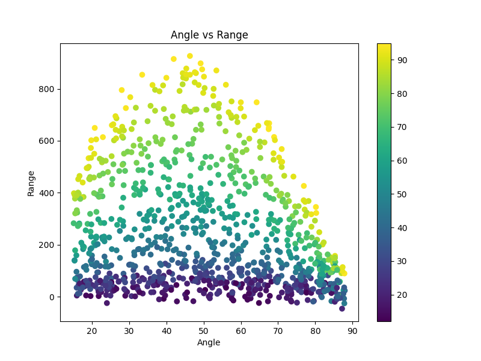
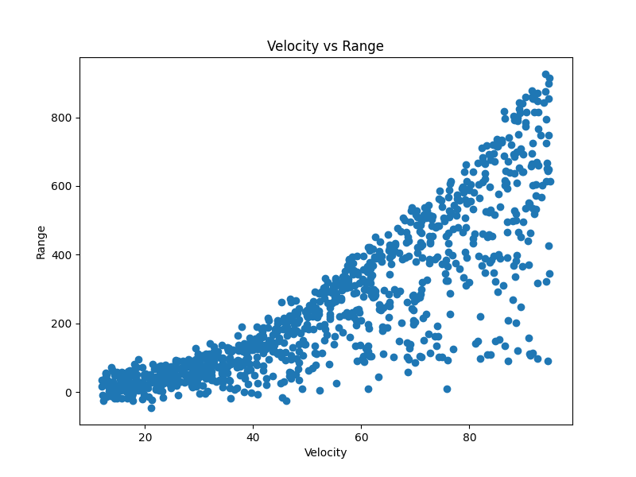
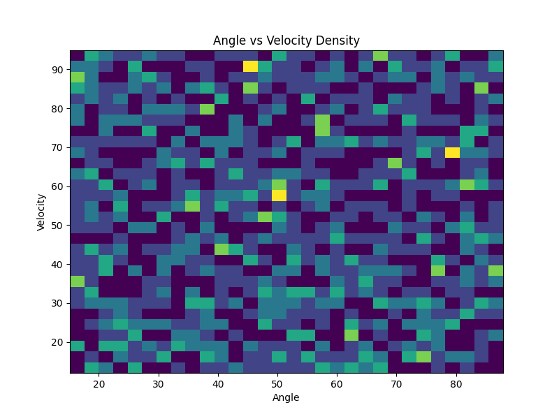
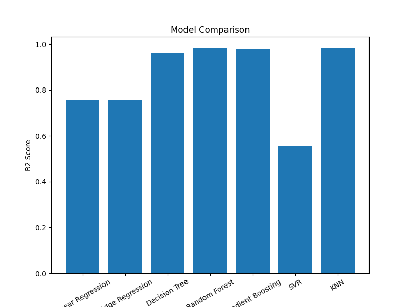
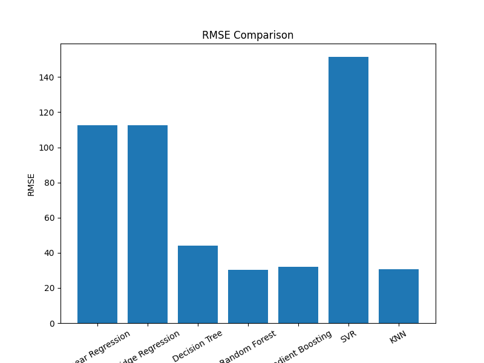
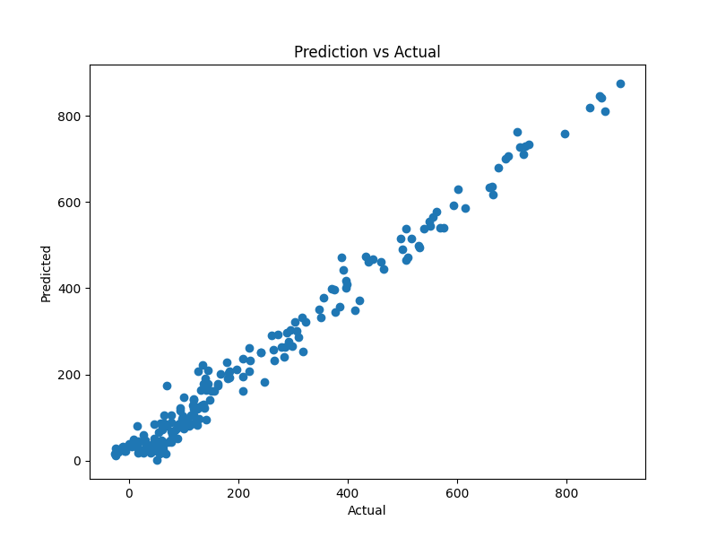
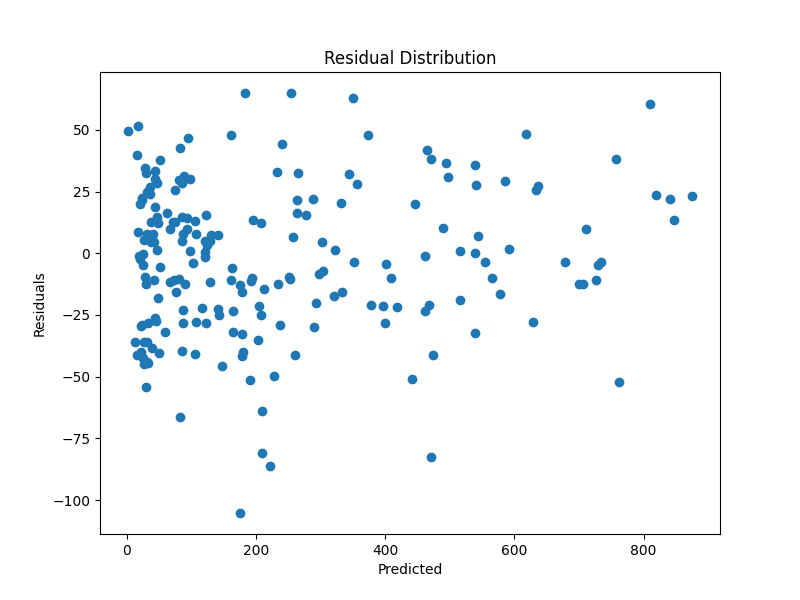
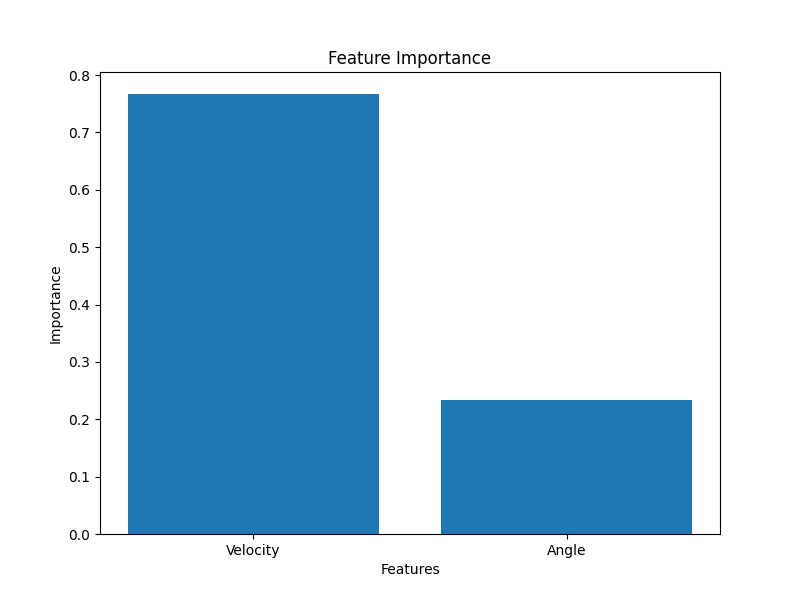

# Simulation-Driven Data Generation and Regression Model Evaluation

This project demonstrates how mathematical modelling and simulation can be used to generate synthetic datasets and evaluate machine learning regression algorithms.

Instead of using externally collected data, a physics-based simulation is implemented to produce structured observations governed by projectile motion equations. The generated dataset is then used to train and compare multiple machine learning models.

---

## Objective

The aim of this project is to:

- Develop a simulation-based data generation workflow  
- Create synthetic data using mathematical modelling  
- Train regression models on simulated observations  
- Evaluate predictive performance using statistical metrics  
- Compare model effectiveness for nonlinear systems  

This approach highlights the integration of modelling, simulation, and machine learning.

---

## Simulation Overview

Projectile motion is used as the physical system for simulation. The motion is governed by deterministic equations, while Gaussian noise is added to simulate real-world measurement uncertainty.

The simulation produces structured data similar to readings obtained from sensors in engineering systems.

---

## Mathematical Model

Projectile range equation:

R = (v² · sin(2θ)) / g  

Where:

- v = launch velocity  
- θ = launch angle  
- g = gravitational acceleration (9.81 m/s²)

This nonlinear equation makes the dataset suitable for regression analysis.

---

## Simulation Parameters

| Parameter | Description | Range |
|----------|-------------|------|
| Velocity | Initial speed | 12 – 95 m/s |
| Angle | Launch angle | 15° – 88° |
| Gravity | Constant | 9.81 m/s² |
| Samples | Generated observations | 1000 |

---

## Dataset Generation

Synthetic data is generated using a physics simulation pipeline:

1. Random parameter generation  
2. Projectile range calculation  
3. Noise injection  
4. Dataset creation  
5. Export to CSV  

Output dataset:

`simulation_dataset.csv`

---

## Simulation Visualizations

### Angle vs Range Distribution

---

### Velocity vs Range Relationship

---

### Angle–Velocity Density Distribution

---

## Machine Learning Workflow

1. Load dataset  
2. Split into training and testing sets  
3. Train regression models  
4. Evaluate performance  
5. Compare results  

---

## Regression Models Implemented

- Linear Regression  
- Ridge Regression  
- Decision Tree Regressor  
- Random Forest Regressor  
- Gradient Boosting Regressor  
- Support Vector Regressor  
- K-Nearest Neighbors Regressor  

---

## Evaluation Metrics

### R² Score
Measures variance explained by the model.

### RMSE
Measures prediction error magnitude.

---

## Model Evaluation Visualizations

### R² Comparison

---

### RMSE Comparison

---

### Prediction vs Actual

---

### Residual Distribution

---

### Feature Importance

---

## Results

Observations:

- Linear models show limited performance due to nonlinear relationships  
- Tree-based models adapt better to structured data  
- Ensemble models achieve highest predictive accuracy  
- Random Forest and Gradient Boosting perform best overall  

---

## Project Structure

### Notebooks
- physics_simulation_pipeline.ipynb  
- regression_training_evaluation.ipynb  

### Generated Files
- simulation_dataset.csv  
- model_metrics.csv  

### Visual Outputs
- physics_simulation_visual.png  
- velocity_range_relationship.png  
- angle_velocity_density.png  
- regression_model_comparison.png  
- rmse_model_comparison.png  
- prediction_vs_actual.png  
- residual_error_distribution.png  
- feature_importance_plot.png  

---

## Technology Stack

Python, NumPy, Pandas, Matplotlib, Scikit-learn, Google Colab

---

## Author

**Name:** Himayat Singh Tiwana  
**Roll No:** 102313049
