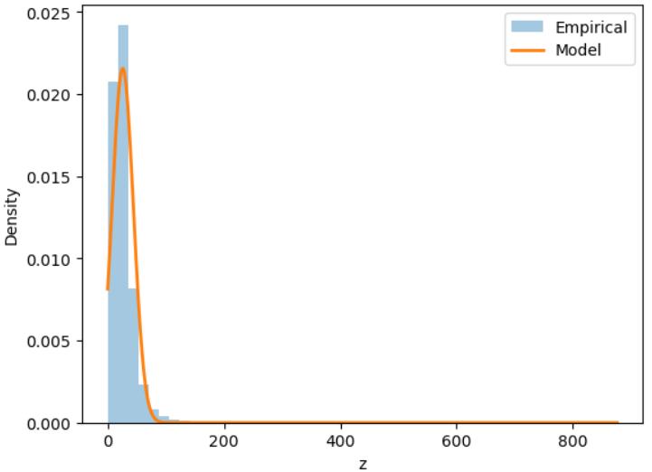

# Assignment 1

This work uses NO2 values from the India Air Quality dataset. After cleaning non‑numeric entries, the NO2 column was kept as the feature.

## Method

Each NO2 value x was transformed using
z = x + a_r * sin(b_r * x)
where a_r = 0.05 * (r mod 7) and b_r = 0.3 * (r mod 5 + 1). The roll number r fixes a_r and b_r.

After transformation, the data was treated as coming from a density of the form
p(z) = c * exp(-λ (z - μ)^2).

The mean μ and standard deviation σ of z were computed directly. Using σ, the constants were set as
λ = 1 / (2σ^2)
c = 1 / sqrt(2πσ^2)

## Results

| Parameter | Value |
|----------|-------|
| μ (mean) | 25.819751672076507 |
| λ        | 0.001461926988966829 |
| c        | 0.021571875520386332 |

The notebook with full code is included in the repository.
